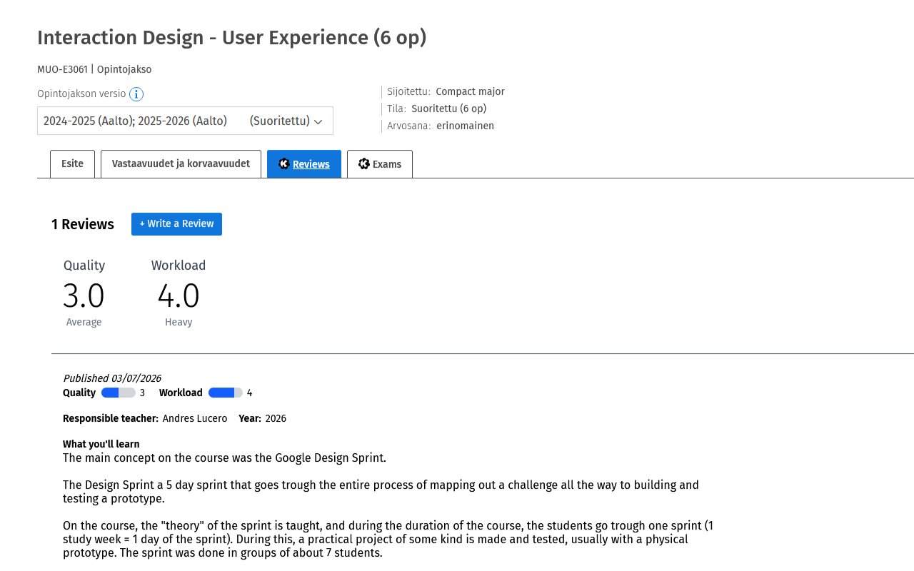
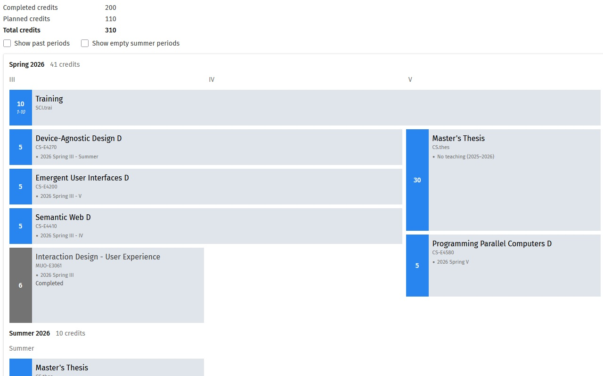
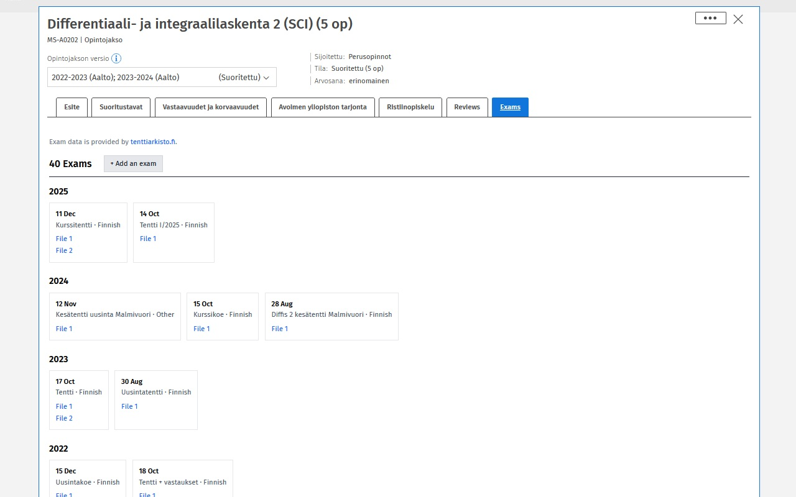

## Commands

To build the production code, run

```bash
npm ci
npm  run make-release
```

## Operating system & environment

This environment was used, but other are likely to work as well.

Node v22.19.0
npm 10.9.3
Windows 11 25H2

## Extension store info (for Chrome and Firefox extension stores)

### Short description (forced < 132 characters by Chrome Web Store)

[The short extension description is in the "description" field of the manifest.json file](/packages/extension/public/manifest.json)

### Long description (recommended < 250 characters by Firefox Add-ons)

```
KurssiKone seamlessly integrates with Sisu (the Finnish student information system) used by Aalto University.

Features:
- Course reviews by students
- Custom timeline view
- Past exams for courses
```

### Screenshots

Screenshots are in Chrome mandatory size of 1,280 x 800 px. Firefox would reccomend 2400 x 1800px.






